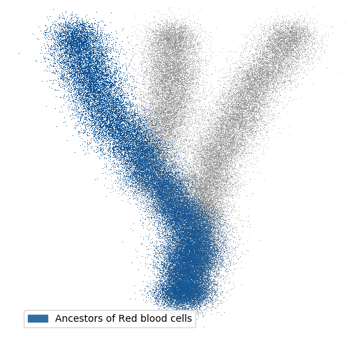
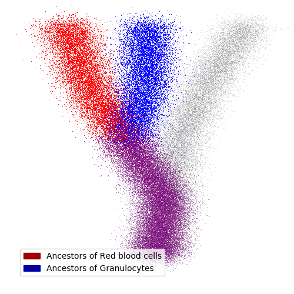
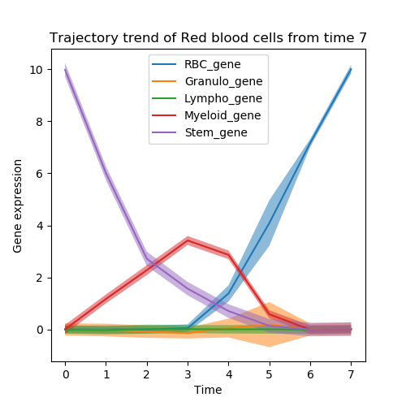
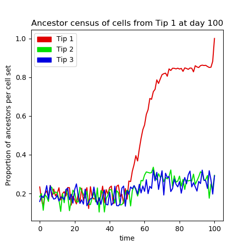
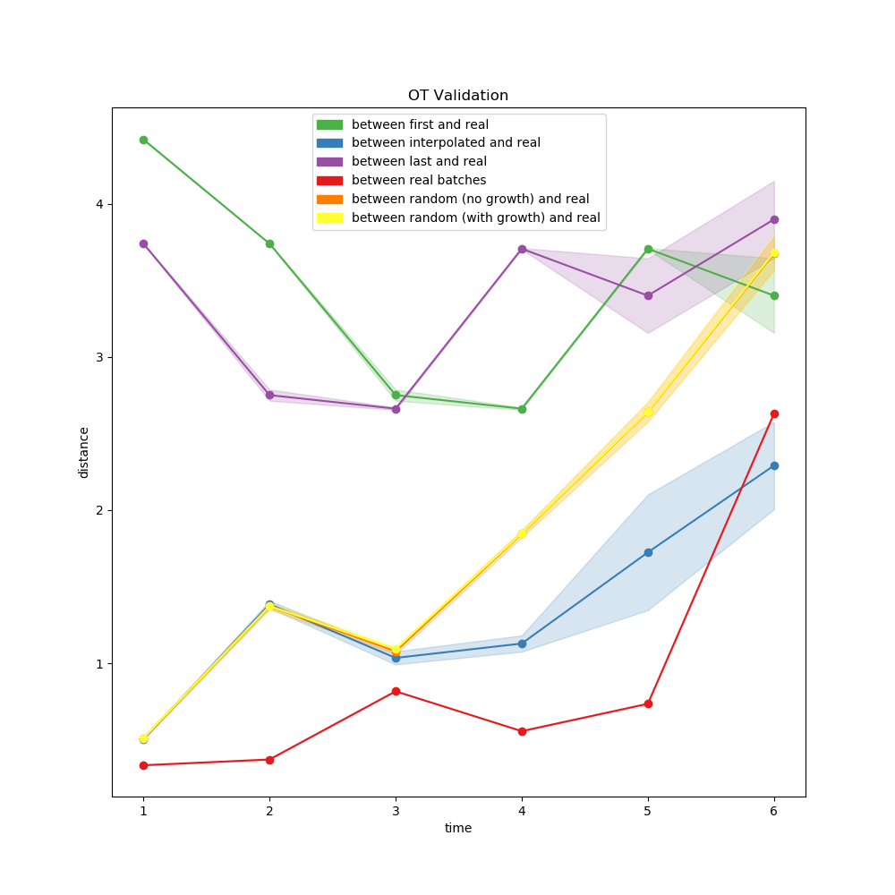

# Using wot from Python
-----------------------

This notebook provides a running example with simulated data to walk
you through the most important tools of **wot**.

You can read the code and the detailed comments below, and simply
copy-paste it into a python interpreter, or download the whole
python script for a specific section by clicking the download
button next to the section title.

The examples below will show you how to generate your own simulated
data using **wot**'s simulate module, and compute transport maps
for it to generate your own plots.

Alternatively, we also provide simulated data with all transport maps
precomputed, and an archive with all of the scripts presented in this
notebook. Just click the button below to download the whole archive.

<div class="center-block text-center py-2">
  <a class="nounderline btn-outline-secondary btn-lg border px-3 py-2 mx-3"
     role="button" href="http://www.mediafire.com/file/01ahkjrsjjzt56l/all_simulated_data.zip">Download all data</a>
  <a class="nounderline btn-outline-secondary btn-lg border px-3 py-2 mx-3"
     role="button" href="all_scripts.zip">Download all scripts</a>
</div>

<br />

<a class="btn-info rounded border-0 px-3 py-1 btn-example nounderline"
 href="00_generating_data.py">Download python code</a>
## Simulating data ##
---------------------

```python

```

<a class="btn-info rounded border-0 px-3 py-1 btn-example nounderline"
 href="02_plotting_two_features.py">Download python code</a>
## Plotting two features ##
---------------------------

```python

```


<a class="btn-info rounded border-0 px-3 py-1 btn-example nounderline"
 href="03_plotting_cell_sets.py">Download python code</a>
## Cell sets ##
---------------

```python

```


<a class="btn-info rounded border-0 px-3 py-1 btn-example nounderline"
 href="01_create_tmaps.py">Download python code</a>
## Create Transport Maps ##
-------------------------------

> If you have downloaded our precomputed transport maps, you can skip this section.

To compute ancestors and descendants, you will need to compute transport maps using an OT Model, storing all
parameters for the transport maps. You can initialize it in python, for future use :

```python

```

You can then use `wot.load_ot_model` to load this model, with the same parameters.


<a class="btn-info rounded border-0 px-3 py-1 btn-example nounderline"
 href="04_plotting_ancestors.py">Download python code</a>
## Ancestors of a cell set ##
-----------------------------

```python

```




<a class="btn-info rounded border-0 px-3 py-1 btn-example nounderline"
 href="05_plotting_shared_ancestry.py">Download python code</a>
## Shared ancestry ##
---------------------

```python

```




<a class="btn-info rounded border-0 px-3 py-1 btn-example nounderline"
 href="06_plotting_trajectory_trends.py">Download python code</a>
## Trajectory trends ##
---------------------

```python

```




<a class="btn-info rounded border-0 px-3 py-1 btn-example nounderline"
 href="07_plotting_ancestor_census.py">Download python code</a>
## Ancestor census ##
---------------------

```python

```




<a class="btn-info rounded border-0 px-3 py-1 btn-example nounderline"
 href="08_plotting_validation_summary.py">Download python code</a>
## Validation summary ##
---------------------

```python

```


